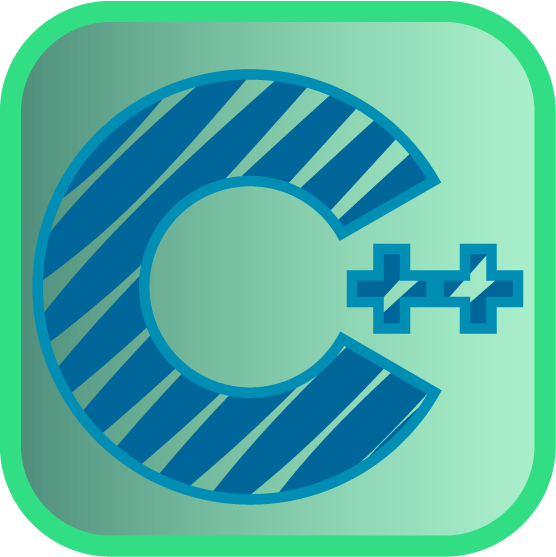

<h1 align="center">Hi there !👋 I myself <b>Jayesh Warhadi !</b></h1>

###

<h2 align="center">😎  ME</h2>

###

I'm <b>Jayesh Warhadi</b> ...  from NMIT Pune....  - 📚 I'm currently studying ... <b>Computer Science and Engineering</b> - ⚡ In my free time I ... love <b>Coding</b> - 🔭 I’m currently working on <a href="https://github.com/jayeshwarhadi/ChessWithC" target="_blank">Chess.C</a> (SideProject) -🔭 I’m currently working on <a href="https://github.com/jayeshwarhadi/PlutonAI" target="_blank">PlutonAI (GenAI Hackathon)</a> - 🌱 I’m currently learning <b>C++ (DSA) , C , S.Y CSE</b> - 📫 Reach me by Email <a href="mailto:jayesh.warhadi2005@gmail.com">jayesh.warhadi2005@gmail.com</a>

###

  
  
  

###

<h2 align="left">🛠 Language and tools</h2>

###

  
  
  
  
  
  
  
  
  
  
  

###

<h3 align="left">🔥   My Stats :</h3>

###

  

###

  
  

###
